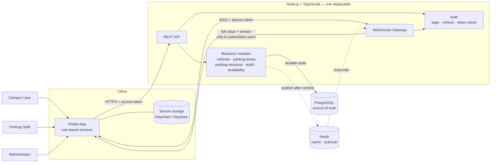
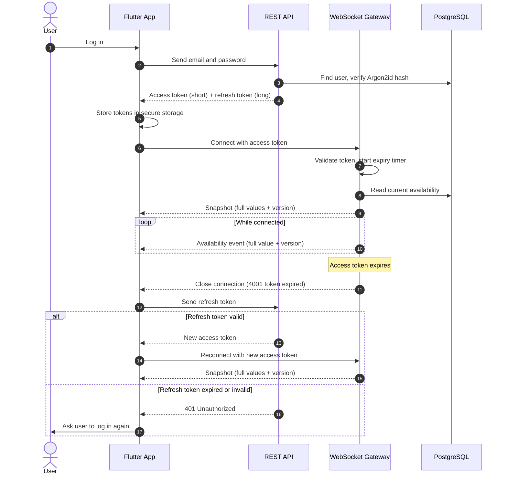

# RFC-001 — System Architecture

**Status:** Draft — ready for mentor review  
**Decision owner:** Intern / Junior Engineer  
**Reviewers:** Product Owner, Mentor

---

# 1. Context

The Campus Parking Management System helps campus users find available
parking and record when they enter and leave, and helps staff and
administrators manage parking areas and capacity correctly.

Without real-time availability, users may travel to a parking area only to
find it full, then waste time driving around or moving to another area.

The most important correctness requirement is capacity. The system must
never admit more vehicles than an area can hold. Availability shown on
screen may lag reality by a few seconds, but the check-in decision itself
must always be exact.

The required technologies are PostgreSQL, Redis, Node.js, and Flutter.
The backend is written in TypeScript, as agreed with the mentor.
Real-time availability is delivered through WebSocket. All roles use one
Flutter mobile app.

---

# 2. Business Constraints

| Group | Constraints | Architectural impact |
|---|---|---|
| Identity and access | normal registration; seeded STAFF/ADMIN accounts; role-based screens and actions | Authentication and authorization happen on the server. The app only hides screens; the server always checks permissions. |
| Vehicles | vehicle ownership; unique plate+province; multiple active vehicles per user | Enforced by PostgreSQL constraints and checked inside the check-in transaction. |
| Parking correctness | one active session per vehicle; area vehicle-type restrictions; operating hours; capacity enforcement; capacity override | All check-in rules are decided in one PostgreSQL transaction. This is the only place that can admit a vehicle. |
| History and accountability | immutable completed history; manual close; audit | Completed sessions are never updated. Manual close and its audit record are written in the same transaction. |
| Real-time | real-time availability; reconnect and state resynchronization | The server is the source of truth. After reconnecting, the app must discard its old state and load the current state from the server before applying new events. |

Operating hours and area status are separate. Status is controlled only
by administrators (open, closed, maintenance). Operating hours define
when normal entry is allowed. A new check-in is accepted only when the
status is open and the current time is within operating hours. Time never
changes the status, because a closed area may still be closed for another
reason, such as flooding or maintenance.

Operating hours control new check-ins only. Vehicles already parked when
an area reaches its closing time are not removed and can still check out.

---

# 3. Goals

The proposed architecture should:

- be understandable by a small team;
- keep business logic testable;
- preserve correctness under concurrent operations;
- make durable state ownership clear;
- support real-time client updates;
- support local development;
- support future scaling without unnecessary complexity;
- maintain an audit trail for important system changes and administrative actions;
- keep business rules configurable (vehicle types, user types, plate types)
  instead of hard-coding them.

---

# 4. Non-Goals

Do not optimize prematurely for:

- global multi-region operation;
- millions of users;
- microservice count as a goal;
- service mesh;
- event sourcing unless strongly justified;
- separate staff/admin web application;
- individual parking slot management (capacity is managed at parking-area level);
- hardware integration such as gates, sensors, or license plate cameras.

---

# 5. Architecture Diagram

> The diagrams assume HTTP and WebSocket run in one deployable unit.
> This is confirmed or changed in sections 6 and 7.

## 5.1 Components

## 5.2 Authentication and Real-Time Flow

## 5.3 Paths

- **Durable state path:** Flutter → REST API → business modules →
  PostgreSQL. Every state change is committed in PostgreSQL first.
- **Real-time event path:** after a transaction commits, the module
  publishes the new availability (full value + version) → WebSocket
  gateway → only the clients that subscribed to that area.
- **Authentication path:** REST and WebSocket both validate the access
  token through the same Auth module. Access tokens are short-lived;
  a refresh token is used to get a new one without logging in again.

---

# 6. Decisions

## 6.1 Reconnect and state resynchronization

**Decision:** Send the current availability through WebSocket immediately
after a client connects or reconnects.

**Reason:** The client does not need to combine a REST snapshot with
WebSocket events, so no event can be lost between the two. Ordering is
handled in one place on the server, which is easier to test than handling
it in every client.

**Consequence:** Every availability message contains the full value and a
version (e.g. "area A: 4 units available, version 128"). A missed message
is corrected by the next one, and the client ignores any message older
than the version it already has.

## 6.2 Token expiry on an open WebSocket connection

**Decision:** The server starts a timer at connection time and closes the
connection with close code `4001` when the access token expires.

**Reason:** A connection must not keep receiving data after its token has
expired. A specific close code lets the app tell "token expired" apart
from a network drop.

**Consequence:** On `4001`, the app uses the refresh token to get a new
access token and reconnects, then receives a fresh snapshot (6.1). The
user logs in again only when the refresh token is expired or invalid.

## 6.3 Architecture style and module boundaries

**Decision:** One Node.js + TypeScript application, organized as a
**modular monolith**. REST and WebSocket run in the same process.

| Module | Responsibility |
|---|---|
| auth | Login, refresh, token validation, password hashing (Argon2id) |
| users | User accounts and user types |
| vehicles | Register, update, soft-delete vehicles |
| parking-areas | Areas, capacity units, status, operating hours, accepted vehicle types |
| parking-sessions | Check-in, checkout, manual close, capacity override |
| audit | Record and read privileged actions |
| availability | Compute and publish current availability |
| realtime | WebSocket gateway: connections, subscriptions, delivery |

Rules between modules:

- A module calls another module only through its public functions,
  never its tables directly.
- Each table has one writing module. Example: only `parking-sessions`
  writes `parking_sessions`.

## 6.4 Where business rules live

- **Application layer (use cases):** permission checks, ownership checks,
  operating hours, vehicle-type restrictions, capacity checks.
- **PostgreSQL constraints:** rules the database can protect by itself —
  one active session per vehicle, unique plate, foreign keys, checks such
  as `units_used > 0`.
- **HTTP and WebSocket layers:** no business rules. They only parse input,
  call a use case, and return the result.
- **Flutter app:** no business rules. Hiding a screen is only for user
  experience; the server always decides.

## 6.5 How HTTP and WebSocket interact

- **All writes go through REST.** WebSocket is a one-way push channel
  from the server to the app. The app never changes state over WebSocket.
- After a transaction **commits**, the module publishes an availability
  event. The realtime module sends it to subscribed clients.
- Events are published **after commit, never before**. If an event were
  sent before commit and the transaction then failed, users would see
  availability that never actually happened.

## 6.6 PostgreSQL and Redis responsibilities

| | PostgreSQL | Redis |
|---|---|---|
| Role | Single source of truth | Helper only; can be rebuilt |
| Stores | All business state and history | Event fan-out between instances (pub/sub); optional availability cache |
| Used for check-in decision | ✅ Always | ❌ Never |
| If data is lost | Real damage | Nothing lost; rebuilt from PostgreSQL |

## 6.7 Behavior when Redis is down

- Check-in, checkout, and all writes continue normally (PostgreSQL only).
- Availability reads fall back to PostgreSQL; they may be slower.
- With one instance, real-time events still work (delivered in-process).
- With several instances, events between instances stop. Clients still
  receive correct data on their next reconnect snapshot.
- Correctness is never affected, because Redis never decides admission.

## 6.8 Behavior when PostgreSQL is down

- All writes fail with a clear error (`503`). The API never reports
  success for a change that was not committed.
- New WebSocket connections cannot receive a snapshot, so the server
  closes them; the app retries with backoff.
- The health check reports the service as unhealthy.

## 6.9 Horizontal scaling

- MVP runs **one instance**. The expected load (a few hundred check-ins
  at peak) does not need more.
- The design still allows several instances later:
  - REST requests are stateless; any instance can serve any request.
  - Correctness does not depend on in-memory state or in-process locks;
    concurrency is protected in PostgreSQL (RFC-003).
  - Real-time events cross instances through Redis pub/sub.
  - Any instance can serve a WebSocket client, because the snapshot comes
    from PostgreSQL. No sticky sessions are required.
  - The load balancer must support WebSocket upgrades.

---

# 7. Alternatives Compared

### Option A — Single Node.js application (chosen)
HTTP, WebSocket, and application logic in one deployable unit.

### Option B — Split real-time component
HTTP API and a separate WebSocket gateway service, connected through
Redis pub/sub.

### Option C — Microservices by domain
Separate services for identity, vehicles, parking, and real-time, each
with its own deployment.

| Criteria | A — Single app | B — Split real-time | C — Microservices |
|---|---|---|---|
| Complexity | Low | Medium | High |
| Development effort | Low: one codebase, one run command | Medium: two services, shared auth logic | High: many services, contracts between them |
| Deployment effort | One deployable | Two deployables + Redis required | Many deployables, service discovery |
| Consistency | Business change and audit in one transaction; events after commit in the same process | Same for writes; events always depend on Redis | Check-in and audit may span services; needs distributed transactions or eventual consistency |
| Observability | One log stream, easy to trace a request | Two log streams; need correlation IDs | Distributed tracing required |
| Scaling | Scale the whole app; enough for campus load | Scale WebSocket separately | Scale each service separately |
| Intern project fit | ✅ Best | ⚠️ Possible later | ❌ Too much overhead |

**Why not B now:** separate scaling of WebSocket connections is not
needed at campus scale. Because the `realtime` module already has a
clear boundary and uses Redis pub/sub for cross-instance events, it can
be moved into its own service later without redesigning other modules.

**Why not C:** it adds network and consistency problems (for example,
keeping a check-in and its audit record together) with no benefit at
this scale.

---

# 8. Failure Scenarios

| Scenario | Expected behavior |
|---|---|
| Node.js process restart | Uncommitted transactions are rolled back by PostgreSQL, so no partial state remains. WebSocket clients are disconnected, reconnect with backoff, and receive a fresh snapshot. |
| PostgreSQL unavailable | Writes fail with `503`; no false success. New WebSocket connections are closed and retried. Health check is unhealthy. (6.8) |
| Redis unavailable | Business operations continue. Availability may be slower. Cross-instance events stop; reconnect snapshots stay correct. (6.7) |
| WebSocket clients disconnected | The app reconnects with exponential backoff and jitter, then receives a full snapshot. Old local state is discarded. (6.1) |
| One API instance fails during a request | If the transaction did not commit, nothing changed and the client may retry. If it committed but the response was lost, the client retry is safe because check-in and checkout are idempotent (RFC-006). |
| One real-time instance restarts | Its clients reconnect through the load balancer to any instance and receive a snapshot from PostgreSQL. No events need to be replayed. |
| Stale client connection | The server sends a ping every 30 seconds and closes connections that do not respond. Expired tokens are closed with `4001` (6.2). Clients ignore messages with an older version than they already have. |

---

# 9. Security Considerations

| Topic | Approach |
|---|---|
| Trust boundaries | The mobile app is **untrusted**. The API is the only trusted entry point. PostgreSQL and Redis are internal and trust only the API. |
| Authentication boundary | The `auth` module verifies passwords (Argon2id) and issues a short-lived access token and a long-lived refresh token. REST and WebSocket validate tokens through the same module. |
| Authorization boundary | Every use case checks role and ownership in the application layer. Hiding screens in the app is not security. |
| Secrets | Database passwords and token signing keys come from environment variables. They are never committed; the repo contains only `.env.example`. |
| Network exposure | Only the API is public, over HTTPS / WSS behind a reverse proxy. PostgreSQL and Redis are on a private network with no public port. |
| WebSocket authentication | The token is checked when the connection opens. It is not sent in the URL query string, because URLs are often written to logs. The server decides which channels a user may subscribe to; personal events go only to that user. |
| Internal service trust | Not applicable: there is one service. If the real-time component is split later (Option B), Redis access must be restricted to the internal services. |

---

# 10. Testing Impact

| Test type | How the architecture supports it |
|---|---|
| Unit tests | Business rules live in application-layer use cases with no HTTP or WebSocket code, so they can be tested directly. |
| Integration tests | Call REST endpoints against a running app with a real database. |
| Real database tests | Run against real PostgreSQL in Docker (not a mock) to prove constraints: one active session per vehicle, unique plate, foreign keys. |
| WebSocket tests | Connect a test client: rejected without a valid token; receives a snapshot on connect; receives an event after a check-in commits; receives no event when the transaction fails; closed with `4001` when the token expires. |
| Concurrency tests | Send many check-ins at the same time for the last available units; exactly the allowed number succeed (AC-H01). Repeat checkout twice; units are released once. |
| End-to-end tests | Run the Flutter app against the full local stack (API, PostgreSQL, Redis via Docker Compose) for the demo scenarios. |

Because everything runs as one application plus two containers, the full
stack starts locally with one command, which keeps every test type
practical for a small team.

---

# 11. Decision Summary

**Chosen architecture:** a modular monolith in Node.js + TypeScript,
serving REST and WebSocket from one process, with PostgreSQL as the
single source of truth and Redis as a rebuildable helper for event
fan-out and caching.

**Rationale:**
- Capacity correctness needs one authoritative decision point; a single
  PostgreSQL transaction provides it.
- A business change and its audit record must commit together, which is
  simple in one application and one database.
- Campus load is small; one instance is enough.
- One codebase is easier for a small team to understand, test, and run.

**Tradeoffs:**
- All modules scale together.
- Module boundaries are protected by code structure and review, not by
  network separation.
- System availability depends on PostgreSQL.

**Consequences:**
- All writes go through REST; WebSocket only pushes.
- Events are published only after commit, with full values and versions.
- No correctness logic may depend on memory or Redis, so adding
  instances later stays safe.

**Rejected options:**
- **Option B (split real-time):** not needed at this scale; kept as a
  future path because the `realtime` module has a clear boundary.
- **Option C (microservices):** adds distributed consistency problems
  and operational cost with no benefit for this project.

---

# 12. Open Questions

1. **Capacity override:** Who can override capacity, and when? Does it mean
   admitting a vehicle above capacity, or reducing capacity below current
   usage?
2. **Operating hours:** How should areas that close after midnight
   (e.g. 22:00–06:00) or stay open 24 hours be represented?
3. **User types:** Does `user_types` combine permissions (user / staff /
   admin) and person categories (student / lecturer), or should they be
   separate?
4. **Real-time deployment:** Is one application serving both REST and
   WebSocket (Option A) acceptable for MVP, or should the WebSocket
   gateway be a separate service from the start (Option B)?
